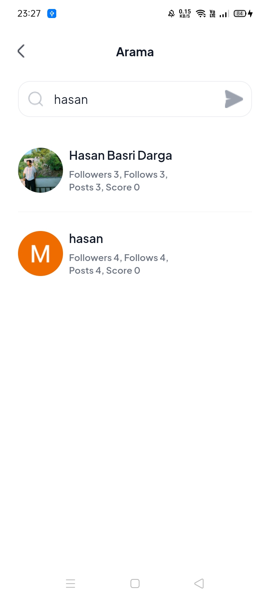
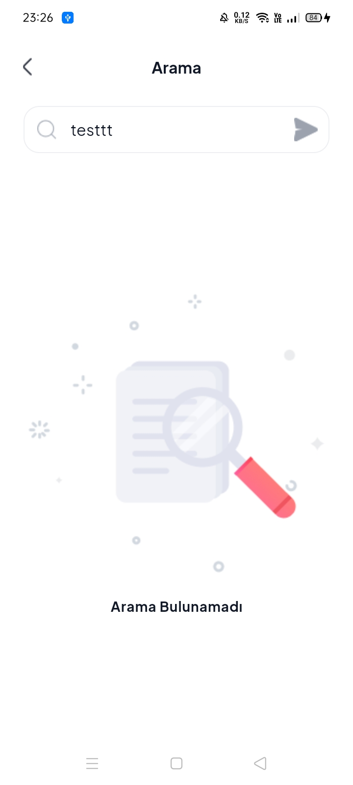

# Word Prime
Word Prime is an innovative application designed to help users learn many words together in a memorable and enjoyable way. By enriching the learning process with a quiz system and task features, it promotes social interaction through tracking, leaderboards, and a points system. Users can create posts with words, sentences, and images associated with those words; edit, delete, and save these posts. Additionally, it offers a social learning environment with options for commenting, sharing, and other interactions. Features like user and word search facilitate exploration and connections, while multi-user support enables a broad community to engage with each other.

<details>
<summary>📖 Click me for TR</summary>
<h1>Word Prime</h1>
Word Prime, kullanıcıların birçok kelimeyi birlikte akılda kalıcı ve eğlenceli bir şekilde öğrenmesini hedefleyen yenilikçi bir uygulamadır. Quiz sistemi ve görev özellikleriyle öğrenme sürecini zenginleştirirken, takip etme, liderlik tablosu ve puan sistemiyle sosyal etkileşimi teşvik eder. Kullanıcılar, kelimeler, cümleler ve bu kelimeleri çağrıştıran görsellerle gönderiler oluşturabilir; bu gönderileri düzenleyebilir, silebilir ve kaydedebilir. Ayrıca, yorum yapma, paylaşma ve diğer etkileşim seçenekleriyle sosyal bir öğrenme ortamı sunar. Kullanıcı ve kelime arama gibi özelliklerle keşif ve bağlantılar kolaylaşırken, çoklu kullanıcı desteği geniş bir topluluğun etkileşimde bulunmasını sağlar.
</details>

## App Dark Mode Screenshots EN

<details>
    <summary>Splash And Onboarding Flow</summary>
    <table>
        <tr>
            <td>Splash Page</td>
            <td>Onboarding First Page</td>
        </tr>  
        <tr>
            <td></td>
            <td></td>
        </tr>
    </table>
    <table>
        <tr>
            <td>Onboarding Second Page</td>
            <td>Welcome Page</td>
        </tr>  
        <tr>
            <td></td>
            <td></td>
        </tr>
    </table>
</details>

<details>
    <summary>Login And Register Flow</summary>
    <table>
        <tr>
            <td>Login Page</td>
            <td>Register Page</td>
        </tr>  
        <tr>
            <td></td>
            <td></td>
        </tr>
    </table>
    <table>
        <tr>
            <td>Forgot Password Method Page</td>
            <td>Forgot Password Page </td>
        </tr>  
        <tr>
            <td></td>
            <td></td>
        </tr>
    </table>
</details>

<details>
    <summary>Main Tab Flow</summary>
    <table>
        <tr>
            <td>Home Page</td>
        </tr>  
        <tr>
            <td></td>
        </tr>
    </table>
</details>

<details>
    <summary>Add Post (Word) Flow</summary>
    <table>
        <tr>
            <td>Add New Word Page</td>
            <td>My Added Word List Page</td>
        </tr>  
        <tr>
            <td></td>
            <td></td>
        </tr>
    </table>
    <table>
        <tr>
            <td>My Saved Word List Page</td>
        </tr>  
        <tr>
            <td></td>
        </tr>
    </table>
</details>

<details>
    <summary>Post Details Flow</summary>
    <table>
        <tr>
            <td>Post Details With Image</td>
            <td>Post Details Without Image</td>
        </tr>  
        <tr>
            <td></td>
            <td></td>
        </tr>
    </table>
    <table>
        <tr>
            <td>Bottom Sheet Comment</td>
        </tr>  
        <tr>
            <td></td>
        </tr>
    </table>
</details>

<details>
    <summary>User Profile Details</summary>
    <table>
        <tr>
            <td>User Profile Details Posts</td>
            <td>User Profile Details Saveds</td>
        </tr>  
        <tr>
            <td></td>
            <td></td>
        </tr>
    </table>
    <table>
        <tr>
            <td>User Profile Details Likeds</td>
            <td>User Profile Details Follow</td>
        </tr>  
        <tr>
            <td></td>
            <td></td>
        </tr>
    </table>
    <table>
        <tr>
            <td>User Profile Details Follower</td>
        </tr>  
        <tr>
            <td></td>
        </tr>
    </table>
</details>

<details>
    <summary>Search Flow</summary>
    <table>
        <tr>
            <td>Search Post</td>
            <td>Search User</td>
        </tr>  
        <tr>
            <td></td>
            <td></td>
        </tr>
    </table>
    <table>
        <tr>
            <td>Search Not Found</td>
        </tr>  
        <tr>
            <td></td>
        </tr>
    </table>
</details>

## App Light Mode Screenshots TR

<details>
    <summary>Splash And Onboarding Flow</summary>
    <table>
        <tr>
            <td>Splash Page</td>
            <td>Onboarding First Page</td>
        </tr>  
        <tr>
            <td></td>
            <td></td>
        </tr>
    </table>
    <table>
        <tr>
            <td>Onboarding Second Page</td>
            <td>Welcome Page</td>
        </tr>  
        <tr>
            <td></td>
            <td></td>
        </tr>
    </table>
</details>

<details>
    <summary>Login And Register Flow</summary>
    <table>
        <tr>
            <td>Login Page</td>
            <td>Register Page</td>
        </tr>  
        <tr>
            <td></td>
            <td></td>
        </tr>
    </table>
    <table>
        <tr>
            <td>Forgot Password Method Page</td>
            <td>Forgot Password Page </td>
        </tr>  
        <tr>
            <td></td>
            <td></td>
        </tr>
    </table>
</details>

<details>
    <summary>Main Tab Flow</summary>
    <table>
        <tr>
            <td>Home Page</td>
        </tr>  
        <tr>
            <td></td>
        </tr>
    </table>
</details>

<details>
    <summary>Add Post (Word) Flow</summary>
    <table>
        <tr>
            <td>Add New Word Page</td>
            <td>My Added Word List Page</td>
        </tr>  
        <tr>
            <td></td>
            <td></td>
        </tr>
    </table>
    <table>
        <tr>
            <td>My Saved Word List Page</td>
        </tr>  
        <tr>
            <td></td>
        </tr>
    </table>
</details>

<details>
    <summary>Post Details Flow</summary>
    <table>
        <tr>
            <td>Post Details With Image</td>
            <td>Post Details Without Image</td>
        </tr>  
        <tr>
            <td></td>
            <td></td>
        </tr>
    </table>
    <table>
        <tr>
            <td>Bottom Sheet Comment</td>
        </tr>  
        <tr>
            <td></td>
        </tr>
    </table>
</details>

<details>
    <summary>User Profile Details</summary>
    <table>
        <tr>
            <td>User Profile Details Posts</td>
            <td>User Profile Details Saveds</td>
        </tr>  
        <tr>
            <td></td>
            <td></td>
        </tr>
    </table>
    <table>
        <tr>
            <td>User Profile Details Likeds</td>
            <td>User Profile Details Follow</td>
        </tr>  
        <tr>
            <td></td>
            <td></td>
        </tr>
    </table>
    <table>
        <tr>
            <td>User Profile Details Follower</td>
        </tr>  
        <tr>
            <td></td>
        </tr>
    </table>
</details>

<details>
    <summary>Search Flow</summary>
    <table>
        <tr>
            <td>Search Post</td>
            <td>Search User</td>
        </tr>  
        <tr>
            <td></td>
            <td></td>
        </tr>
    </table>
    <table>
        <tr>
            <td>Search Not Found</td>
        </tr>  
        <tr>
            <td></td>
        </tr>
    </table>
</details>

## Packages and Technologies Used
This project is built based on the MVVM architecture. ValueNotifier has been used as the primary state management method throughout the project, while Provider is utilized in certain parts. Firebase serves as the backend, enabling CRUD operations, and the application is coded with a focus on responsive design. The main goal of this project is to demonstrate my ability to develop an application using Flutter by adhering to clean code principles and effectively integrating Firebase.

<details>
<summary>📖 Click me for TR</summary>
Bu proje, MVVM mimarisi esas alınarak geliştirilmiştir. State management yöntemi olarak genel yapıda ValueNotifier, bazı bölümlerde ise Provider tercih edilmiştir. Backend tarafında Firebase kullanılarak CRUD işlemleri gerçekleştirilmiş ve uygulama, responsive bir tasarıma uygun şekilde kodlanmıştır. Projenin temel amacı, Flutter ile clean code prensiplerine uygun, etkili bir şekilde kodlama yaparak Firebase entegrasyonu içeren bir uygulama geliştirme yeteneğimi sergilemektir.<br>
<br>
</details>

<p style="margin: 10px 0;"></p>

- State Management
    - ValueNotifier
    - Provider
- Dependency Injection
  - [GetIt](https://pub.dev/packages/get_it)
- Linter
  - [VeryGoodAnalysis](https://pub.dev/packages/very_good_analysis)
- Localization
    - [EasyLocalization](https://pub.dev/packages/easy_localization)
- Firebase
    - [CloudFirestore](https://pub.dev/packages/cloud_firestore)
    - [FirebaseCore](https://pub.dev/packages/firebase_core)
    - [FirebaseAuth](https://pub.dev/packages/firebase_auth)
    - [GoogleSignIn](https://pub.dev/packages/google_sign_in)
    - [FirebaseStorage](https://pub.dev/packages/firebase_storage)
- UI
    - [DottedBorder](https://pub.dev/packages/dotted_border)
    - [CachedNetworkImage](https://pub.dev/packages/cached_network_image)
    - [FlutterSpinkit](https://pub.dev/packages/flutter_spinkit)
- Utilities
    - [Equatable](https://pub.dev/packages/equatable)
    - [SharedPreferences](https://pub.dev/packages/shared_preferences)
    - [ImagePicker](https://pub.dev/packages/image_picker)
    - [EventBus](https://pub.dev/packages/event_bus)
       
## Folder Structure
```plaintext
word_prime/
└── assets/
│    └── fonts/    
│    └── images/
│    └── langs/
└── lib/
│    └── base/
│    │    └── enums/
│    │    └── events/
│    │    └── initialize/
│    │    └── repository/
│    │    └── base_firestore.dart
│    │    └── base_model.dart
│    │    └── base_stateful_state.dart
│    │    └── base_view_model.dart    
│    └── generated/
│    │    └── locale_keys.g.dart
│    └── models/
│    └── providers/    
│    └── routes/
│    └── services/
│    └── ui/
│    │    └── pages/
│    │    │    │
│    │    │    │
│    │    │    └── home/
│    │    │    │    └── components/
│    │    │    │    └── home_page.dart
│    │    │    │    └── home_provider.dart
│    │    │    │    └── home_view_model.dart
│    │    │    │   
│    │    └── widgets/
│    │    │    └── post_widgets/
│    │    │    │    └── interact_items_column.dart
│    │    │    │    └── interact_items_row.dart
│    │    │    │    └── post_user_info.dart
│    │    │    │    └── post_with_image.dart
│    │    │    │    └── post_without_image.dart 
│    │    │    │
│    │    │    │
│    │    │    └── custtom_app_popup.dart  
│    │    │    └── custtom_button.dart
│    │    │    └── custtom_text_form_field.dart
│    │    │    │  
│    │    │    │
│    └── utils/
│    │    └── extensions/
│    │    └── theme/
│    │    │    └── custom_app_bar_theme.dart
│    │    │    └── custom_app_theme.dart
│    │    │    └── custom_color_scheme.dart
│    │    │    └── custom_text_scheme.dart  
│    │    └── app_assets.dart 
│    │    └── app_paddings.dart
│    │    └── app_sizes.dart
│    │    └── app_utility.dart      
│    └── export.dart
│    └── firebase_options.dart    
│    └── main.dart
```

## Run this project

#### Clone this repository

```bash
git clone https://github.com/DargaHasanBasri/word_prime.git
```

#### Go to the project directory

```bash 
cd word_prime
```

##### Get all the packages

```bash 
flutter pub get
```